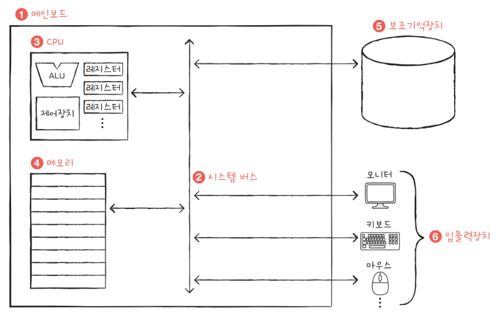

# 컴퓨터 구조

## 컴퓨터 구조를 알아야 하는 이유

* 컴퓨터 구조를 이해하면 <a>문제 해결</a> 능력이 향상된다.
* 컴퓨터 구조를 이해하면 문법만으로는 알기 어려운 <a>성능 / 용량 / 비용</a>을 고려하며 개발할 수 있다.

## 컴퓨터의 구조
* 컴퓨터가 이해하는 정보
    * 데이터(data) : 정적인 정보 (ex. 컴퓨터가 이해하는 숫자, 문자, 이밎, 동영상 등)
    * 명령어(instruction) : 데이터를 움직이고 컴퓨터를 작동시키는 정보

컴퓨터의 구조

* 컴퓨터의 네가지 핵심 부품
    * 중앙처리장치(CPU : Central Processing Unit)
    * 주기억장치(main memory, 이하 메모리)
        * 메모리는 RAM(Random Access Memory), ROM(Read Only Memory)가 있지만 통상적으로 메모리는 RAM을 가리킨다.
    * 보조기억장치(secondary storage)
    * 입출력장치(I/O device : input/output device)

### 메모리
* 프로그램이 실행되기 위해서는 반드시 메모리에 저장되어 있어야 한다.
* 메모리는 현재 실행되는 프로그램의 명령어와 데이터를 저장한다.
* 메모리에 저장된 값의 위치는 주소(address)로 알 수 있다.

### CPU
* CPU는 메모리에 저장된 값을 읽어 들이고, 해석하고, 실행하는 장치
* CPU의 구성요소
    * 산술논리연산장치(ALU : Arithmetic ALogic Unit) : 계산하는 장치
    * 레지스터(register) : 임시 저장 장치
    * 제어장치(CU, Control Unit) : 제어 신호를 발생시키고 명령어를 해석하는 장치
        * CPU가 메모리에 저장된 값을 읽고 싶을 때 메모리를 향해 <a style="color:yellow">메모리 읽기</a>라는 제어신호를 보낸다.
        * CPU가 메모리에 값을 저장하고 싶을 때 메모리를 향해 <a style="color:yellow">메모리 쓰기</a>라는 제어신호를 보낸다.

### 보조기억장치
* 가격이 싸고 크기가 크고 전원이 꺼져도 저장된 내용을 잃지 않는 메모리
* 가격이 비싸고 크기가 작고 전원이 꺼지면 저장된 내용을 잃는 메모리를 보조할 저장 장치. 메모리는 <a style="color:yellow">실행되는</a> 프로그램을 저장하고 보조기억장치는 <a style="color:yellow">보관할</a> 프로그램을 저장한다.

### 입출력장치
* 컴퓨터 외부에 연결되어 컴퓨터 내부와 정보를 교환하는 장치
    * 마이크, 스피커, 프린터, 마우스, 키보드 등

### 메인보드와 시스템 버스
* 메인보드(main board) : 컴퓨터의 핵심 부품들이 연결된 판, 마더보드(mother board)라고도 불림
* 시스템 버스(system bus) : 메인보드에 연결된 부품들이 서로 정보를 주고 받는데 사용되는 통로
    * 주소 버스(address bus) : 주소를 주고받는 통로
    * 데이터 버스(data bus) : 명령어와 데이터를 주고받는 통로
    * 제어 버스(control bus) : 제어 신호를 주고받는 통로