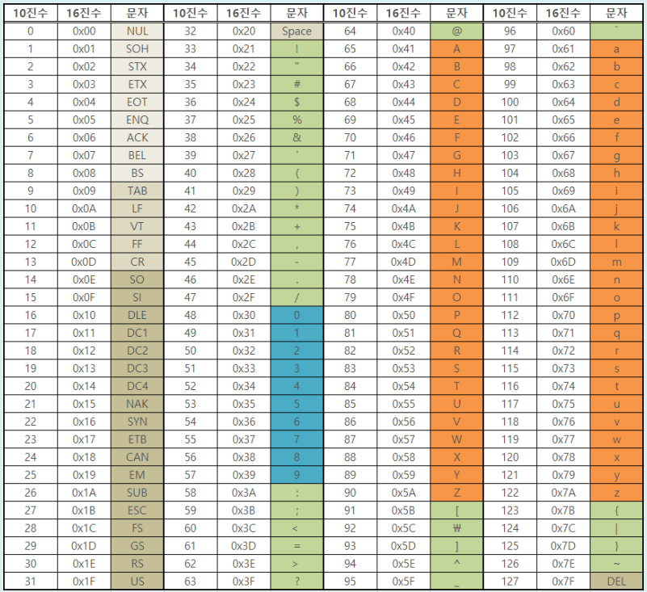
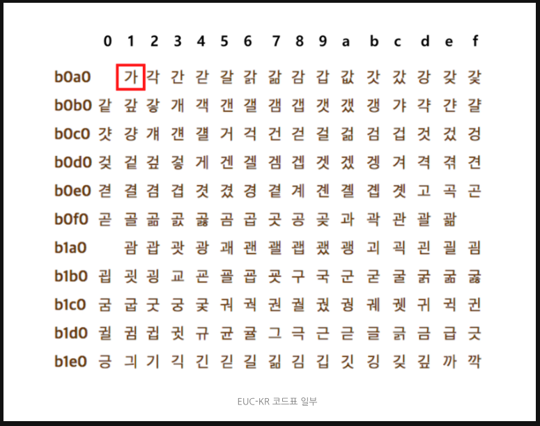
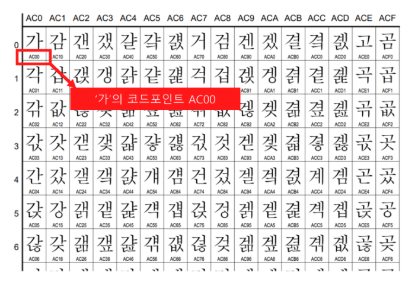
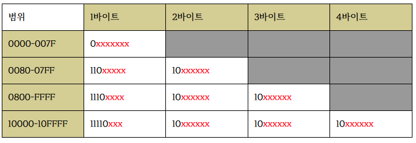

# 데이터

## 0과 1로 숫자를 표현하는 방법

### 정보 단위
* 비트(bit)
    * 0과 1을 나타내는 가장 작은 정보 단위
* 바이트(byte)
    * 1byte = 8bit
    * $2^8$ = 256개의 정보를 표현할 수 있음
* 킬로바이트(kB : kilobyte)
    * 1kB = 1000byte
* 메가바이트(MB : megabyte)
    * 1MB = 1000kB
* 기가바이트(GB : gigabyte)
    * 1GB = 1000MB
* 테라바이트(TB : terabyte)
    * 1TB = 1000GB
* KiB, MiB, GiB, TiB
    * 1000개가 아닌 1024개씩 묶어 표현한 단위
* 워드(word)
    * CPU가 한번에 처리할 수 있는 데이터의 크기
        * ex) CPU가 한 번에 16비트를 처리할 수 있다면 1워드=16비트, CPU가 한 번에 32비트를 처리할 수 있다면 1워드=32비트
    * 워드의 크기에 따른 정의
        * 하프 워드(half word) : 절반 크기
        * 풀 워드(full word) : 1배 크기
        * 더블 워드(double word) : 2배 크기
    * ex) 인텔의 x86 CPU는 32비트 워드 CPU, x64 CPU는 64비트 워드 CPU

### 이진법 (binary)
* 0과 1만으로 모든 숫자를 표현하는 방법 -> 이진법으로 표현한 수를 이진수 라고 한다.
* 이진수의 표기 : 이진수 끝에 아래첨자 $_{(2)}$를 붙이거나 이진수 앞에 `0b`를 붙인다. 전자의 경우 주로 수학적으로 표기할 때, 후자의 경우 주로 코드 상에서 이진수를 표기할 때 사용된다.
* 음수 표현 : 2의 보수(two's complement)
    * 사전적 정의 : 어떤 수를 그보다 큰 2^n에서 뺀 값
        * $11_{(2)}$의 2의 보수는 $11_{(2)}$보다 큰 $2^n$, 즉 100(2)에서 $11_{(2)}$를 뺀 $01_{(2)}$가 되는 것이다.
    * 이해한 2의 보수 : 모든 0과 1을 뒤집고 1을 더한 값
        * $11_{(2)}$의 모든 0과 1을 뒤집으면 $00_{(2)}$, 여기에 1을 더하면 $01_{(2)}$가 된다.
    * 그러나 2의 보수만으로는 음수를 확인하기 어렵다 -> $0101_{(2)}$가 양수인지 음수인지 알 수 없다 -> 플래그(flag)를 사용
    * 2의 보수의 한계 : 0이나 $2^n$의 값은 원하는 음수값을 얻을 수 없다.
        * $0000_{(2)}$의 2의 보수는 $10000_{(2)}$, $1000_{(2)}$의 2의 보수는 자기자신($1000_{(2)}$)가 된다. 즉 n비트는 $2^n$, $-2^n$을 동시에 표현할 수 없다. 0의 경우는 1을 버려도 무방하다. 결국 -0도 0이기 때문이다.

### 십육진법(hexadecimal)
* 이진법의 경우 숫자의 길이가 너무 길어진다는 단점이 있기 때문에 십육진법도 자주 사용한다. 10부터는 A부터 알파벳을 사용한다.
* 십육진수의 표기 : 아래첨자 $_{(16)}$을 붙이거나 `0x`를 붙인다.
* 십육진법을 사용하는 이유 : 컴퓨터는 이진법을 사용하는데 이진법과 십진법을 변환하기는 어렵지만 이진법과 십육진법을 변환하는 것은 쉽기 때문이다.

 
 
 

## 0과 1로 문자를 표현하는 방법

### 문자 집합과 인코딩
* <a style="color:yellow">문자 집합(character set)</a>
    * 컴퓨터가 인식하고 표현할 수 있는 문자의 모음
* 문자 인코딩(character encoding)
    * 문자를 0과 1로 변환하는 과정
    * 인코딩 후 0과 1로 이루어진 결과값이 문자 코드가 됨
    * 같은 문자 집합에 대해서도 다양한 인코딩 방법이 있을 수 있음
* 문자 디코딩(character decoding)
    * 인코딩의 반대 과정 = 0과 1로 이루어진 문자 코드를 사람이 이해할 수 있는 문자로 변환하는 과정

### 아스키코드(ASCII : American Standard Code for Information Interchange)
* 초창기 문자 집합 중 하나
* 영어 알파벳, 아라비아 숫자, 일부 특수 문자를 포함
* 7비트로 표현되며 총 $2^7=128$개의 문자를 표현할 수 있다.
    * 실제로는 하나의 아스키 문자를 나타내기 위해 8비트(1바이트)를 사용한다. 하지만 8비트 중 1비트는 패리티 비트(parity bit)라고 불리는 오류 검출을 위해 사용되는 비트이기 때문에, 실질적으로 문자 표현을 위해 사용되는 비트는 7비트이다.

* 아스키코드 : 아스키 문자에 대응된 고유한 수
    * 'A'는 십진수 65(이진수 $1000001_{(2)}$)로 인코딩되고, 'a'는 십진수 97(이진수 $1100001_{(2)}$)로, 문자 !는 십진수 33(이진수 $100001_{(2)}$)으로 인코딩된다.
    * 아스키코드표를 보면 backspace, escape, cancel, space와 같은 제어 문자도 포함되어 있다.
* 코드 포인트(code point) : 문자 인코딩에서 "글자에 부여된 고유한 값"
    * 아스키문자 A의 코드 포인트 : 65
* 장점 : 매우 간단하게 인코딩이 가능
* 단점 : 한글을 포함하여 아스키 문자 집합 외의 문자, 특수문자를 표현할 수 없음
    * 단점 보완을 위해 1비트를 추가하여 8비트의 확장 아스키(Extended ASCII)가 등장하였지만 그럼에도 표현 가능한 문자의 수는 $2^8=256$개여서 터없이 부족

### EUC-KR
* 알파벳을 쭉 이어 쓰면 단어가 되는 영어와는 달리, 한글은 각 음절 하나하나가 초성, 중성, 종성의 조합으로 이루어져 있음 -> 한글 인코딩을 위해서는 한글의 특수성을 알아야 함
* 한글 인코딩에는 두가지 방식이 존재
    1. 완성형 인코딩
        * 완성된 하나의 글자에 고유한 코드를 부여하는 방식
        * ex) '가'는 1, '나'는 2, '다'는 3 등..
    2. 조합형 인코딩
        * 초성을 위한 비트열, 중성을 위한 비트열, 종성을 위한 비트열을 할당하여 그것들의 조합으로 하나의 글자 코드를 완성하는 방식
        * ex) '강'은 'ㄱ' `0010`, 'ㅏ' `0011`, 'ㅇ' `0001 00011`을 합쳐 `0010 0011 0001 00011`로 포현
* EUC-KR은 `KS X 1001`, `KS X 1003`이라는 문자 집합을 기반으로 하는 대표적인 완성형 인코딩 방식 -> 초성, 중성, 종성이 모두 결합된 한글 단어에 2바이트 크기의 코드를 부여
    * 한글 한 글자에 2바이트, 즉 16비트가 필요 -> 네 자리 십육진수로 표현 가능. 즉 EUC-KR로 인코딩 된 한글은 네 자리 십육진수로 나타낼 수 있음
    * ex) '가' : $b0a1_{(16)}$, '거' : $b0c5_{(16)}$

* EUC-KR 인코딩 방식으로 총 2350개 정도의 한글 단어 표현 가능. 아스키코드보다 ㅁ낳은 문자를 표현할 수 있지만 모든 한글 조합을 표현하기는 불가능('쀍', '쀓', '믜' 같은 글자는 표현 불가능) -> 이러한 문제를 보완하기 위해 마이크로소프트의 CP949(Code Page 949) : EUC-KR의 확장 버전이지만 이마저도 넉넉한 양은 아님

### 유니코드(unicode)
* EUC-KR보다 훨씬 다양한 한글을 포함하며 대부분 나라의 문자, 특수문자, 화살표나 이모티콘까지도 코드로 표현할 수 있는 통일된 문자 집합

* 아스키코드나 EUC-KR은 글자에 부여된 값을 그대로 인코딩 값으로 사용하였지만, 유니코드는 글자에 부여된 값 자체를 인코딩된 값으로 삼지 않고 이 값을 다양한 방법으로 인코딩한다. 이런 인코딩 방법에는 크게 UTF-8, UTF-16, UTF-32 등이 있다.
    * UTF : Unicode Transformation Format

### UTF-8
* 유니코드 인코딩 방법 중 가장 대중적인 방법
* 1바이트부터 4바이트까지의 인코딩 결과를 만들어 낸다. 즉 UTF-8로 인코딩한 값의 결과는 1바이트가 될 수도, 2바이트, 3바이트, 4바이트가 될 수 있다.

* 유니코드 문자에 부여된 값의 범위가 0부터 $007F_{(16)}$까지는 1바이트로 표현
* 유니코드 문자에 부여된 값의 범위가 $0080_{(16)}$부터 $07FF_{(16)}$까지는 1바이트로 표현
* 유니코드 문자에 부여된 값의 범위가 $0800_{(16)}$부터 $FFFF_{(16)}$까지는 1바이트로 표현
* 유니코드 문자에 부여된 값의 범위가 $10000_{(16)}$부터 $10FFFF_{(16)}$까지는 1바이트로 표현

* 변환 방법
    * 붉은색 X표가 있는 곳에 유니코드 문자에 부여된 고유한 이진수 값이 들어가면 됨
    * 예시 : "한글" 바꿔보기
        1. "한" : $D55C_{(16)}$, "글" : $AE00_{(16)}$
        2. "한" : $1101\ 0101\ 0101\ 1100_{(2)}$, "글" : $1010\ 1110\ 0000\ 0000_{(2)}$
        3. 결과
            * "한" : $1110\textcolor{red}{1101}\ 10\textcolor{red}{010101}\ 10\textcolor{red}{011100}_{(2)}$
            * "글" : $1110\textcolor{red}{1010}\ 10\textcolor{red}{111000}\ 10\textcolor{red}{000000}_{(2)}$