# Dijkstra(다익스트라)
* 최단 경로 알고리즘 종류 중 하나. 특정 지점에서 다른 특정 지점까지의 최단 경로를 구하거나 모든 지점에서 다른 모든 지점까지의 최단 경로를 구하는 알고리즘

## 다익스트라 vs 밸만-포드 vs 플로이드-워셜
<table>
    <tr>
        <th rowspan="3">공통점</th>
        <td>세 알고리즘 모두 최단 경로를 구함</td>
    </tr>
    <tr><td>그래프는 방향/무방향 모두 가능</td></tr>
    <tr><td>모두 그래프 이론 기반</td></tr>
</table>

<br>
<hr>
<br>

|항목|다익스트라(Dijkstra)|밸만-포드(Bellman-Ford)|플로이드-워셜(Floyd-Warshall)|
|:---:|:---:|:---:|:---:|
|음수 가중치 허용|❌ 안됨|✅ 가능|✅ 가능|
|음수 사이클 처리|❌ 안됨|✅ 가능|✅ 가능|
|출발점 기준|단일 출발점 &rarr; 모든 노드|단일 출발점 &rarr; 모든 노드|모든 쌍 간 최단 경로|
|시간 복잡도|O(E+VlogV) (heap 사용 시)|O(V×E)|O(V³)|
|알고리즘 방식|Greedy|DP|DP|
|실제 사용 예시|네비게이션, 게임 AI 등|음수 가중치 있는 금융 모델 등|모든 경로 분석, 네트워크 분석 등|

## 다익스트라 알고리즘
* 동작 설명
    ```
    1. 거리, 방문 테이블 준비(거리 테이블은 INF, 방문 테이블은 False로 초기화)
    2. 시작 노드 선택(방문 처리)
    3. 연결되어 있는 노드와의 최단 거리 갱신(거리 테이블 갱신)
    4. 갱신 후 아직 방문하지 않은 노드 중 가장 거리가 짧은 노드를 선택(방문 제외)
    5. 3~4번 과정을 반복
    ```
* 동작 예시
    1. 거리 테이블의 값은 해당 노드로 연결되어 있지 않다는 것을 의미(해당 노드로 갈 수 없음)하는 INF값으로 설정하고, 방문 테이블의 값은 해당 노드를 아직 방문하지 않았음을 의미하는 False로 초기화 한다.

        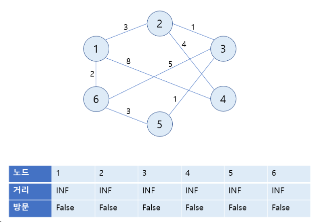

    2. 시작 노드를 선택(1번 노드)하여 방문 처리하고 시작 노드의 거리는 0이므로 거리를 0으로 갱신한다.

        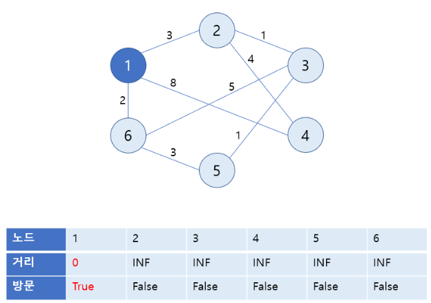

    3. 1번 노드와 연결된 노드와의 간선 가중치에 따라 각 노드와의 거리를 갱신

        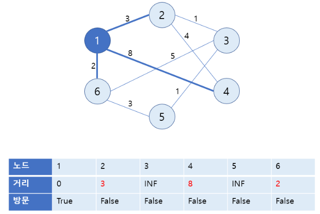

    4. 방문하지 않은 노드 중 거리 값이 가장 작은 노드(6번 노드) 선택하여 방문 방문하지 않은 노드

        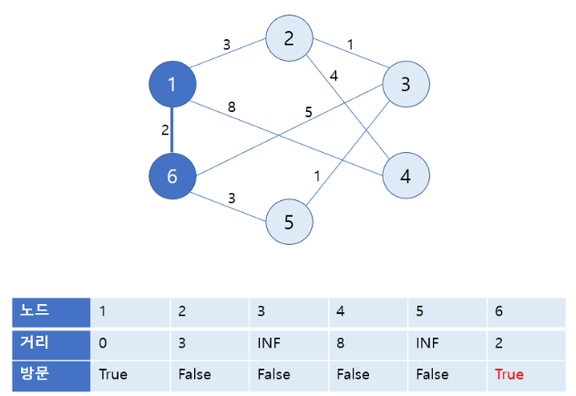

    5. 6번 노드와 연결된 노드와의 간선 가중치에 따라 각 노드와의 거리 업데이트

        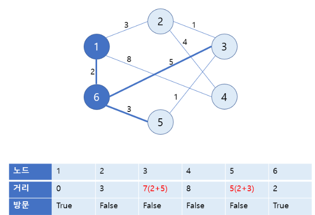

    6. 방문하지 않은 노드 중 거리 값이 가장 작은 노드(2번 노드)를 방문 처리

        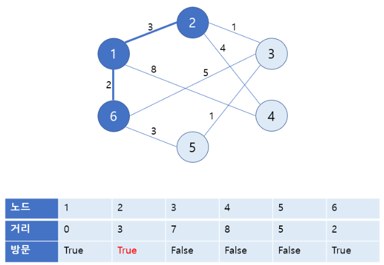

    7. 2번 노드와 연결된 노드들의 거리 갱신

        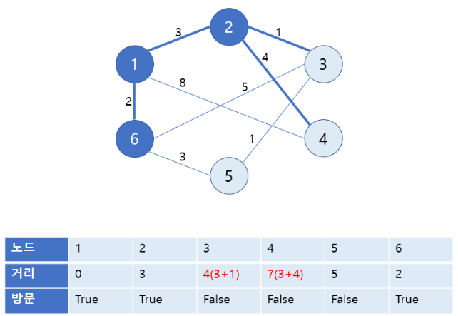

    8. 방문하지 않은 노드 중 거리 값이 가장 작은 노드(3번 노드) 방문 처리

        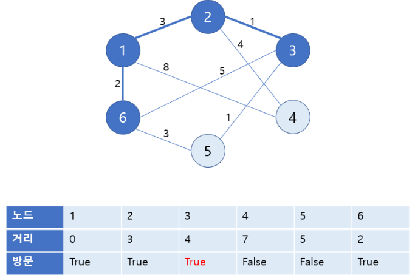

    9. 선택한 노드(3번 노드)와 연결된 노드들의 거리 갱신 -> 갱신 불가

        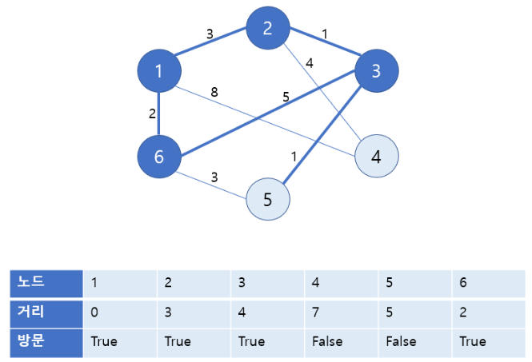

    10. 방문하지 않은 노드 중 거리 값이 가장 작은 노드(5번 노드) 방문 처리

        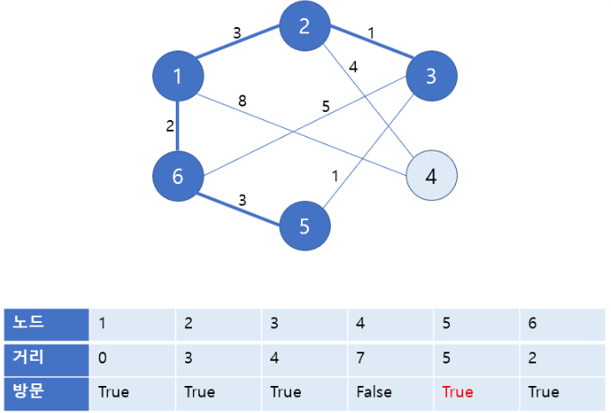

    11. 선택한 노드(5번 노드)와 연결된 노드들의 거리 갱신 -> 갱신 불가

        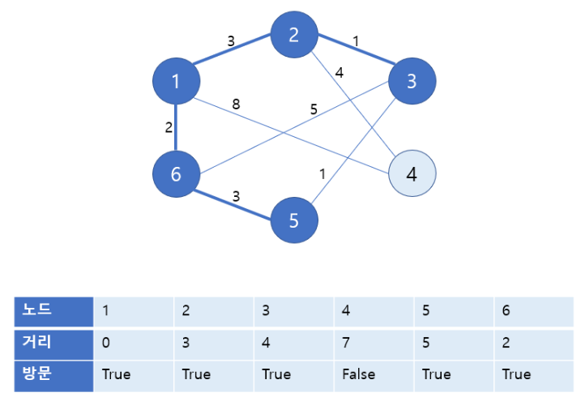

    12. 방문하지 않은 노드 중 거리 값이 가장 작은 노드(4번 노드) 방문 처리

        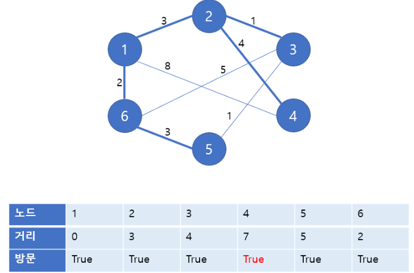

    13. 1을 시작 노드로 다른 모든 노드와의 최단 거리를 구하기 완료

        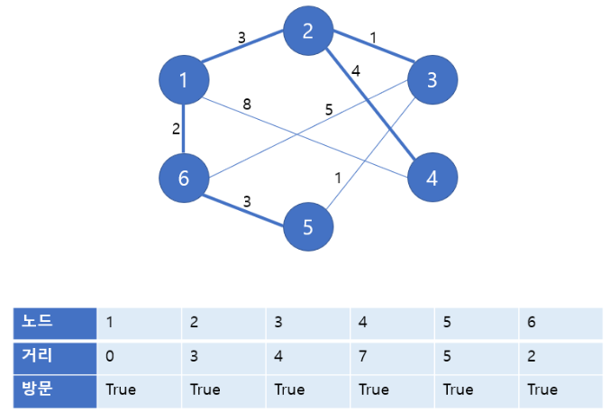

* 사용된 알고리즘
    * greedy : 가장 거리가 짧은 작은 노드만을 선택하기 ㅐ문에
    * DP : 최단 거리는 여러 경로로 구성되어 있기 때문에 이전까지의 최단 경로들을 활용하여 앞으로의 최단 경로를 구하는 과정을 반복


## 구현
https://velog.io/@mjieun/Algorithm-%EB%8B%A4%EC%9D%B5%EC%8A%A4%ED%8A%B8%EB%9D%BCDijkstra-%EC%B5%9C%EB%8B%A8%EA%B2%BD%EB%A1%9C-%EC%95%8C%EA%B3%A0%EB%A6%AC%EC%A6%98-Python

참고
```python
```
```python
# heapq를 활용한 구현
```