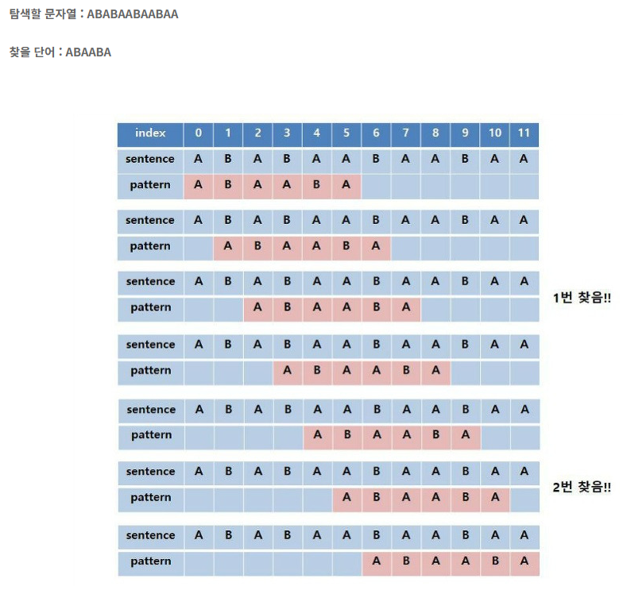
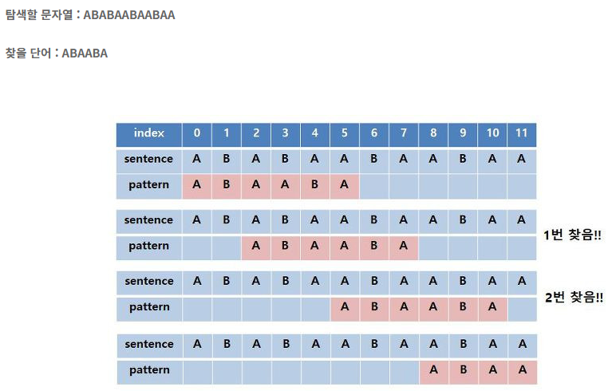
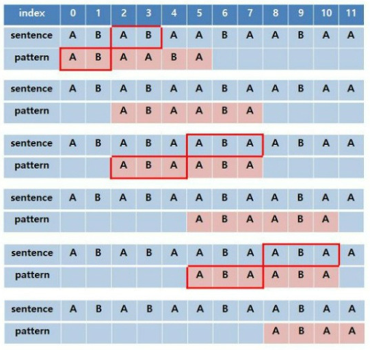
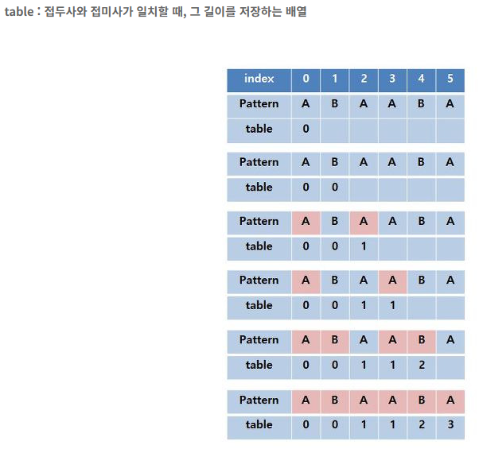

# KMP
* 문자열 검색 알고리즘 -> 고지식한 탐색(브루트포스)의 개선
* 찾을 pattern의 접두사와 접미사를 이용하여 탐색 횟수 감소


## 브루트포스 vs KMP
1. 브루트포스
    * 시간복잡도 : `O(MN)`

        

2. KMP
    * 시간복잡도 : `O(N)`

        


## KMP의 이해



* 맨 처음 탐색의 경우, `sentence[3] != pattern[3]`으로 인해 pattern을 이동해야 함
* 브루트포스의 경우 pattern을 한칸 이동하지만, KMP의 경우 pattern의 접두사와 접미사 일치 길이를 저장했던 정보를 이용하여 그만큼 이동 -> 한번 탐색한 구간은 탐색하지 않음 -> 접두사와 접미사가 일치하는 길이를 저장하는 배열 필요



* pattern의 크기를 탐색하며, i번째까지의 길이에서 접두사와 접미사가 동일할 경우, 배열에 그 길이를 저장


## KMP 구현
```python
# KMP 알고리즘을 수행하기 전, 패턴을 처리하는 함수
# 패턴의 테이블 생성
def KMP_table(pattern):
    lp = len(pattern)
    tb = [0 for _ in range(lp)] # 정보 저장용 테이블
    
    pidx = 0 # 테이블의 값을 불러오고, 패턴의 인덱스에 접근
    for idx in range(1, lp): # 테이블에 값 저장하기 위해 활용하는 인덱스
        # pidx가 0이 되거나, idx와 pidx의 pattern 접근 값이 같아질때까지 진행
        while pidx > 0 and pattern[idx] != pattern[pidx]:
            pidx = tb[pidx-1]

        # 값이 일치하는 경우, pidx 1 증가시키고 그 값을 tb에 저장
        if pattern[idx] == pattern[pidx] :
            pidx += 1
            tb[idx] = pidx
    return tb
```
```python
def KMP(word, pattern):
    # KMP_table 통해 전처리된 테이블 불러오기
    table = KMP_table(pattern)
    
    results = [] # 결과를 만족하는 인덱스 시점을 기록하는 리스트
    pidx = 0
    
    for idx in range(len(word)):
        # 단어와 패턴이 일치하지 않는 경우, pidx를 table을 활용해 값 변경
        while pidx > 0 and word[idx] != pattern[pidx] :
            pidx = table[pidx-1]
        # 해당 인덱스에서 값이 일치한다면, pidx를 1 증가시킴
        # 만약 pidx가 패턴의 끝까지 도달하였다면, 시작 인덱스 값을 계산하여 추가 후 pidx 값 table의 인덱스에 접근하여 변경
        if word[idx] == pattern[pidx]:
            if pidx == len(pattern)-1 :
                results.append(idx-len(pattern)+2)
                pidx = table[pidx]
            else:
                pidx += 1
    
    return results
```