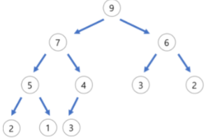
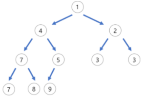

# 우선순위 큐 (Priority Queue)
* 데이터를 추가 한 순서와 상관없이 데이터를 꺼낼 때 값을 오름차순하여 반환하는 자료 구조
* 내부는 데이터를 정렬된 상태로 보관하는 로직이 `heapq`모듈을 통해 구현되어 있음
* 시간복잡도 : `O(logN)`


## priority queue
* priority queue class는 queue 내장 모듈에서 제공
    ```python
    from queue import PriorityQueue
    queue = PriorityQueue()
    ```
* `put` : priority queue에 원소를 추가하는 method
    ```python
    from queue import PriorityQueue
    queue = PriorityQueue()

    queue.put(4)
    queue.put(9)
    queue.put(5)
    queue.put(8)
    ```
* `get` : 원소를 오름차순으로 반환하는 method
    ```python
    from queue import PriorityQueue
    queue = PriorityQueue()

    queue.put(4)
    queue.put(9)
    queue.put(5)
    queue.put(8)

    print(queue.get()) # 4
    print(queue.get()) # 5
    print(queue.get()) # 8
    print(queue.get()) # 9
    ```
    ```python
    # 역순(내림차순)으로 반환하고 싶은 경우
    # tuple, 음수 등을 활용하여 추가/반환 하면 된다.
    from queue import PriorityQueue
    queue = PriorityQueue()

    queue.put((-4, 4))
    queue.put((-9, 9))
    queue.put((-5, 5))
    queue.put((-8, 8))

    print(queue.get()[1]) # 4
    print(queue.get()[1]) # 5
    print(queue.get()[1]) # 8
    print(queue.get()[1]) # 9
    ```
* `qsize` : `len` method와 동일한 기능 (그러나 `len` method는 사용 불가)
    ```python
    from queue import PriorityQueue
    queue = PriorityQueue()

    queue.put(4)
    queue.put(9)
    queue.put(5)

    print(queue.qsize())  # 3
    ```
* `empty` : queue가 비어있는지 확인하는 method
    ```python
    from queue import PriorityQueue
    queue = PriorityQueue()

    queue.put(4)
    print(queue.empty())  # False

    queue.get()
    print(queue.empty())  # True
    ```
* `maxsize` : queue의 size를 제한
    ```python
    from queue import PriorityQueue
    queue = PriorityQueue(maxsize=2)
    # size만 제한할 뿐, 길이는 동일하게 측정
    print(queue.qsize()) # 0

    queue.put(1)
    queue.put(2)
    print(queue.qsize()) # 2

    # size보다 더 많이 put을 하는 경우 error 발생
    queue.put(3) # error
    ```
* `full` : queue가 가득 찼는지 확인하는 method
    ```python
    from queue import PriorityQueue
    queue = PriorityQueue(maxsize=2)

    queue.put(4)
    queue.put(1)
    print(queue.full())  # True

    queue.get()
    print(queue.full())  # False
    ```

## heap
* 완전 이진 트리의 일종으로 priority queue를 위해 만들어진 자료 구조
* 여러 값들 중 최대값이나 최솟값을 빠르게 찾아내도록 만들어진 자료 구조
* 일종의 반정렬 상태(느슨한 정렬 상태)를 유지
    * 큰 값이 상위 레벨에 있고 작은 값이 하위 레벨에 존재
    * 부모 노드의 키 값이 자식 노드의 키 값보다 항상 크거나 작은 이진 트리
    * 중복된 값을 허용

###  heap의 종류
1. 최대 힙(max heap)
    * 부모 노드의 키 값이 자식 노드의 키 값보다 크거나 같은 완전 이진 트리
    
        

    * 부모 노드 >= 자식 노드
2. 최소 힙(min heap)
    * 부모 노드의 키 값이 자식 노드의 키 값보다 크거나 같은 완전 이진 트리
    
        

    * 부모 노드 <= 자식 노드

### 힙 내장 모듈 heapq
* 특징
    * heapq 모듈은 python의 보통 list를 마치 최소 힙처럼 다룰 수 있음
        * python에서 heapq는 기본적으로 최소 힙이다.
        * 빈 list를 생성하여 heapq 모듈의 함수를 호출하여 사용
    * 시간복잡도 : `O(logN)`
* `heappush` : 원소 추가
    ```python
    from heapq import heappush, heappop

    heap = []

    heappush(heap, 4)
    heappush(heap, 2)
    heappush(heap, 8)
    heappush(heap, 1)

    print(heap)
    # [1, 2, 4, 8]
    ```
* `heappop` : 원소 반환
    ```python
    from heapq import heappush, heappop

    heap = []

    heappush(heap, 4)
    heappush(heap, 2)
    heappush(heap, 8)
    heappush(heap, 1)

    print(heappop(heap))
    # 1
    print(heap)
    # [2, 4, 8]
    ```
* `heapify` : 기존 list를 heap으로 변환
    ```python
    from heapq import heapify

    heap = [4, 1, 7, 3, 8, 5]
    heapify(heap)
    print(heap)
    # [1, 3, 5, 4, 8, 7]
    ```