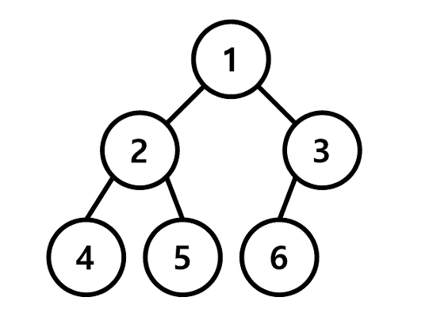

## DFS BFS
* 비선형 구조인 그래프 구조는 그래프로 표현된 모든 자료를 빠짐없이 검색하는 것이 중요하다.
    * BFS = Breadth First Search 너비 우선 탐색
    * DFS = Depth First Search 깊이 우선 탐색

    

* 입력되는 graph의 차이는 노드의 방향이 있는지 없는지에 따라 바뀌게 된다.

    

    1. 노드의 방향이 없는 경우
        ```python
        graph = [[],
            [2, 3],
            [1, 4, 5],
            [1, 6],
            [2],
            [2],
            [3]
            ]
        ```
    2. 노드의 방향이 있는 경우 - ex.위에서 아래로 방향이 있는 경우
        ```python
        graph = [[],
            [2, 3],
            [4, 5],
            [6],
            [],
            [],
            []
            ]
        ```

* DFS의 특징
    * 그래프의 깊은 부분을 우선적으로 탐색하는 알고리즘(세로 탐색)
    * 스택 자료구조를 사용하여 그래프의 가장 깊은 곳까지 방문한 뒤, 다시 돌아가 다른 경로 탐색
* DFS 동작 과정
    1. 탐색 시작 노드를 스택에 삽입하고 방문 처리 (이미 방문(탐색)했던 노드를 재방문 하지 않기 위해서)
    2. 스택의 최상단 노드에 방문하지 않은 인접 노드가 있다면 그 노드를 스택에 넣고 방문 처리. 만약 방문하지 않은 인접 노드가 없으면 스택에서 최상단 노드를 꺼냄.
    3. 2번의 과정을 더 이상 수행할 수 없을 때까지 반복
* BFS의 특징
    * 그래프의 인접한 부분을 우선적으로 탐색하는 알고리즘(가로 탐색)
    * 인접 노드를 계속 큐에 넣어가며 큐에 들어온 순서대로 탐색을 시작하기에 시작 노드에서부터 가까운 노드들부터 탐색
* BFS 동작 과정
    1. 탐색 시작 노드를 큐에 삽입하고 방문 철
    2. 큐에서 노드를 꺼내 해당 노드를 방문하지 않은 모든 인접 노드를 모두 큐에 삽입하고 방문 처리
    3. 2번 과정을 더 이상 수행할 수 없을 때까지 반복
* DFS, BFS의 장단점
    |DFS|BFS|
    |:---:|:---:|
    |스택 또는 재귀함수|큐|
    |최적 해라는 보장 없음|항상 최적 해임을 보장|
    |그래프 큐모가 클 때|그래프 규모가 작을 때|
    |특정 목표 노드를 찾을 때|최단 경로를 찾을 때|
    * DFS 장점
        * 현 경로상의 노드들만 기억하기 때문에 적은 메모리 사용
        * 목표 노드가 깊은 단계에 있는 경우 BFS보다 빠르게 탐색 가능
    * DFS 단점
        * 해가 없는 경로를 탐색할 경우 단계가 끝날때 까지 (현 경로의 가장 끝까지) 탐색함
            * 답이 아닌 경로가 매우 깊다면 그 경로에 깊이 빠지게 됨
            * 여러 경로 중 무한한 길이를 가지는 경로가 존재하고 해가 다른 경로에 존재하는 경우, 무한한 길이의 경로에서 빠져나오지 못해 영원히 종료하지 못함
            * 효율성을 높이기 위해서 미리 지정한 임의 깊이까지만 탐색하고, 해를 발견하지 못하면 빠져나와 다른 경로를 탐색하는 방법을 사용해야 한다. (재귀로 구현한다면 재귀 호출 횟수를 제한하는 등의 방법 사용)
    * BFS 장점
        * 모든 경로를 탐색하기에 여러 해가 있을 경우에도 최단 경로임을 보장함
        * 최단 경로가 존재하면 깊이가 무한정 깊어진다고 해도 답을 찾을 수 있음
            * 여러 경로 중 무한한 길이를 가지는 경로가 존재하더라도, 모든 경로를 동시에 탐색을 진행하기 때문에 탐색 가능
        * 노드의 수가 적고, 깊이가 얕은 해가 존재할 때 유리함
            * 탐색하는 트리 또는 그래프의 크기에 비례하는 시간 복잡도를 가짐
    * BFS 단점
        * 노드의 수가 많을수록 탐색 가지가 급격히 증가함에 따라 보다 많은 메모리를 필요로 하게 된다.
            * 메모리 상의 확장된 노드들을 저장할 필요가 있기에 탐색하는 트리 또는 그래프에 크기에 비례하는 메모리를 가진다.

* DFS BFS code - 탐색 순서 출력하기
    * index number와 node number의 혼동을 피하기 위해서 graph 및 방문을 했는지 확인하는 list(뒤에서 나오는 'visited')에서 실제 node의 수보다 1개 더 크게 만든다.

        

        ```python
        # graph
        graph = [[], # index == 0 이기에 비워둔다.
            [2, 3], # 1번 node와 연결된 node
            [1, 4, 5], # 2번 node와 연결된 node
            [1, 6], # 3번 node와 연결된 node
            [2], # 4번 node와 연결된 node
            [2], # 5번 node와 연결된 node
            [3] # 6번 node와 연결된 node
            ]
        ```
        ```python
        # DFS - 재귀
        n = int(input()) # n = 6

        visited = [False] * (n+1) # index == 0 인 부분 포함
        ans = []

        def dfs(graph, v, visited) :
            ans.append(v)
            visited[v] = True
            for i in graph[v] :
                if not visited[i] :
                    dfs(graph, i, visited)

        dfs(graph, 1, visited)
        print(*ans) # 1, 2, 4, 5, 3, 6
        ```

        

        ```python
        # DFS - stack(큰번호 순서)
        n = int(input()) # n = 6

        def dfs(start):
            visited = []
            stack = [start]
            while stack :
                v = stack.pop()
                if v not in visited :
                    visited.append(v)
                    for w in graph[v] :
                        stack.append(w)
            return visited

        print(*dfs(1))
        ```
        ```python
        # DFS - stack(작은 번호 순서)
        n = int(input()) # n = 6

        def dfs(start):
            visited = []
            stack = [start]
            while stack :
                v = stack.pop()
                if v not in visited :
                    visited.append(v)
                    # graph가 작은 순서로 정렬되어 있기 때문에 뒤집어 줘야 한다.
                    for w in graph[v][::-1] :
                        stack.append(w)
            return visited

        print(*dfs(1))
        ```

        

        ```python
        # BFS - queue
        from collections import deque

        n = int(input()) # n = 6

        visited = [False] * (n+1)
        ans = []

        def bfs(graph, start) :
            ans.append(start)
            queue = deque([start])
            visited[start] = True
            while queue :
                v = queue.popleft()
                for i in graph[v] :
                    if not visited[i] :
                        ans.append(i)
                        queue.append(i)
                        visited[i] = True

        bfs(graph, 1)
        print(*ans) # 1 2 3 4 5 6
        ```