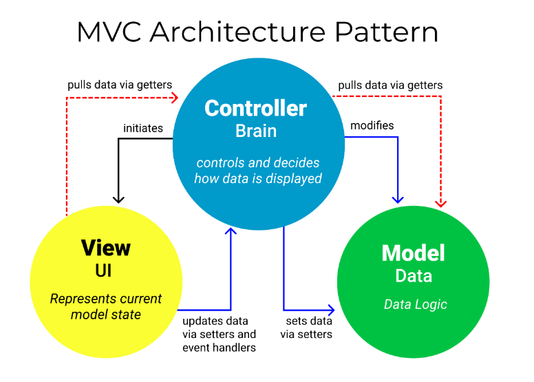

# MVC 패턴

[MDN Web Docs](https://developer.mozilla.org/ko/docs/Glossary/MVC)에서의 MVC 패턴 정의

```
MVC (모델-뷰-컨트롤러) 는 사용자 인터페이스, 데이터 및 논리 제어를 구현하는데 널리 사용되는 소프트웨어 디자인 패턴입니다. 소프트웨어의 비즈니스 로직과 화면을 구분하는데 중점을 두고 있습니다. 
```


## MVC(Model-View-Controller) 패턴이란?



MVC(Model-View-Controller) 페턴은 컴퓨터공학에서 소프트웨어 설계와 아키텍처를 위한 디자인 패턴 중 하나이다. 이 패턴은 주로 UI(User Interface, 사용자 인터페이스)를 가진 응용 프로그램에 사용되며, 어플리케이션의 개발과 유지 보수를 쉽게 하기 위해 데이터, 프레젠테이션, 프로세싱을 서로 분리한다.


## MVC(Model-View-Controller) 패턴 구성 요소
* Model
    * Model은 어플리케이션의 핵심 데이터와 비즈니스 로직을 나타낸다. 데이터 저장소와의 상호 작용, 데이터 처리 및 유효성 검사와 같은 작업을 수행한다. 모델은 독립적으로 작동하며, View와 Controller와 직접적으로 통신하지 않는다.
* View
    * View는 사용자에게 보여지는 어플리케이션의 UI 부분이다. View는 모델에서 데이터를 받아 사용자에게 표시하고, 사용자의 입력을 Controller에 전달한다. View는 어플리케이션의 데이터 표시와 관련된 모든 작업을 처리한다.
* Controller
    * Controller는 사용자 입력을 처리하고, 어플리케이션의 흐름을 관리한다. View에서 전달된 사용자 입력을 분석하고, 적절한 Model 기능을 호출하여 데이터를 조작하거나 업데이트한다. 그런 다음 결과를 다시 View에 전달하여 화면에 표시할 수 있다.


## MVC의 상호작용
1. 사용자가 어플리케이션에서 작업 수행
2. View는 사용자의 입력을 감지하고 Controller에 전달
3. Controller는 사용자의 입력을 처리하고 적절한 Model 기능을 호출하여 데이터를 검색, 수정 또는 저장한다.
4. Model은 데이터와 관련된 비즈니스 로직을 수행하고, 필요한 경우 데이터베이스와 상호 작용한다.
5. 작업이 완료되면 Model은 결과를 Controller에 반환한다.
6. Controller는 Model의 결괄르 받아 View에 전달한다.
7. View는 이 데이터를 사용하여 사용자에게 보여지는 화면을 업데이트한다.


## MVC 페턴의 설계원칙
1. 각 구성 요소의 역할과 책임을 명확하게 구분
    * Model, View, Controller는 독립적으로 작동하고, 각각의 역할에 집중해야 한다.
    * Model : 데이터와 비즈니스 로직을 처리한다. 데이터의 저장, 검색, 수정 등에 집중하며, View와 Controller에 대한 정보는 가지고 있지 않는다.
    * View : UI를 담당하며, Model에서 전달받은 데이터를 화면에 표시한다. View는 사용자의 입력을 받아 Controller에 전달하고, 데이터 표시에만 집중한다.
    * Controller : 사용자 입력을 받아 Model과 View 사이에서 통신을 관리한다. 사용자의 요청을 해석하고, 적절한 Model 함수를 호출하여 데이터를 처리한 후 결과를 View에 전달한다.
2. 구성 요소간의 결합도 최소화
    * 결합도 최소화를 위해 구성 요소간의 직접적인 참조를 피하고, 각 구성 요소는 다른 구성 요소와의 의존성을 최소화해야 한다. 이를 통해 구성 요소를 독립적으로 개발, 수정, 테스트 할 수 있다.
    * 이벤트 기반 통신, 옵저버 패턴, 인터페이스를 통한 의존성 주입 등을 사용하여 구성 요소 간의 결합도를 낮출 수 있다.
3. 코드의 재사용성과 확장성 고려
    * 각 구성 요소는 독립적이고 재사용 가능한 모듈로 개발되어야 한다. 이를 통해 프로젝트의 규모가 커지거나 요구 사항이 변경될 때 쉽게 확장 및 수정할 수 있다. 공통 기능이나 코드를 재사용하기 쉬운 구조로 갭라하여, 비슷한 요구 사항이 있는 다른 프로젝트에서도 사용할 수 있도록 한다. 각 구성 요소를 독립적으로 개발하고 유지 관리할 수 있도록 구조화하면, 어플리케이션의 유연성이 향상된다.


## MVC 패턴의 장단점
* 장점
    * 간단하고 단순한 패턴으로 널리 사용되고 보편적으로 많이 사용되는 디자인 패턴이다.
* 단점
    * View와 Model 사이의 의존성이 높아 완벽한 분리가 힘들다. View와 Model의 높은 의존성은 어플리케이션이 커질 수록 Controller의 코드량이 커져 유지보수가 어렵다.