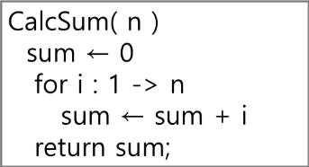
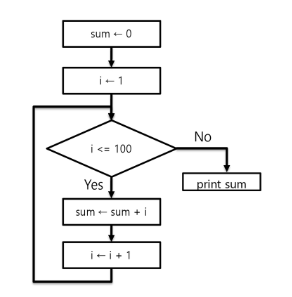

## Algorithm
* 유한한 단계를 통해 문제를 해결하기 위한 절차나 방법
* 주로 컴퓨터용어로 쓰이며, 컴퓨터가 어떤 일을 수행하기 위한 단계적 방법
    * 어떤 문제를 해결하기 위한 절차
* 알고리즘을 표현하는 방법
    1. 의사코드(슈도코드)
        * 
    2. 순서도
        * 
* 알고리즘의 성능
    1. 정확성
    2. 작업량
    3. 메모리 사용량
    4. 단순성
    5. 최적성