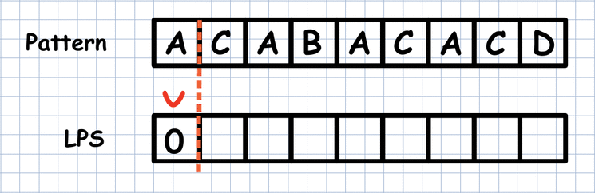

# KMP
* Knuth-Morris-Pratt 알고리즘
* 불일치가 발생한 텍스트 스트링의 앞 부분에 어떤 문자가 있는지를 미리 알고 있으므로, 불일치가 발생한 앞 부분에 대하여 다시 비교하지 않고 매칭을 수행
* 패턴을 전처리하여 배열 next[M]을 구해서 잘못된 시작을 최소화함
    * next[M] : 불일치가 발생했을 경우 이동할 다음 위치
* 시간 복잡도 : O(M+N)
* KMP 알고리즘 비교 과정
    1. text에서 abcdabc까지는 매치되고, e에서 실패한 상황
    2. 맨 앞의 abc와 실패 직전의 abc는 동일함을 이용할 수 있다.
    3. 실패한 문자와 텍스트 P[4]를 비교한다.

    

```python
# index를 찾는 방법

# KMP 알고리즘을 수행하기 전, 패턴을 처리하는 함수
# 패턴의 테이블 생성
def kmp(t, p):
    n = len(t)
    m = len(p)
    lps = [0] * (m+1)

    # preprocessing
    j = 0 # 일치한 개수 == 비교할 패턴 위치
    lps[0] = -1

    for i in range(1, m) :
        lps[i] = j # p[i]이전에 일치한 개수
        if p[i] == p[j] :
            j += 1
        else :
            j = 0
    lps[m] = j

    # search
    i = 0 # 비교할 택스트 위치
    j = 0 # 비교할 패턴 위치
    while i < n and j <= m :
        if j == -1 or t[i] == p[j] : # 첫글자가 불일치 했거나 일치할 경우
            i += 1
            j += 1
        else : # 불일치
            j = lps[j]

        if j == m : # 패턴을 찾을 경우
            print(i-m, end = ' ') # 패턴의 인덱스 출력
            j = lps[j]
    
    print()
    return

t = 'zzzabcdabcdabcefabcd'
p = 'abcdabcef'
kmp(t, p) # 7
t = 'AABAACAADAABAABA'
p = 'AABA'
kmp(t, p) # 0 9 12
t = 'AAAAABAAABA'
p = 'AAAA'
kmp(t, p) # 0 1
t = 'AAAAABAAABA'
p = 'AA'
kmp(t, p) # 0 1 2 3 6 7
```
```python
# lps함수를 짜는 방법

# 부분 일치 테이블(LPS)를 계산하는 함수
def kmp_lps(word) :
    lps = [0] * len(word)
    length = 0 # 이전 lps 길이
    i = 1

    while i < len(word) :
        if word[i] == word[length] :
            length += 1
            lps[i] = length
            i += 1
        else : # word[i] != word[length]
            if length != 0 :
                length = lps[length - 1]
            else : # length == 0
                lps[i] = 0
                i += 1

    return lps


# 책 내에서 단어를 찾는 KMP 알고리즘
def kmp(book, word) :
    global ans

    lps = kmp_lps(word)
    # book index
    i = 0
    # word index
    j = 0

    while i < len(book) :
        if word[j] == book[i] :
            i += 1
            j += 1

        if j == len(word) :
            ans += 1
            j = lps[j - 1]
        elif i < len(book) and word[j] != book[i] :
            if j == 0 :
                i += 1
            else : # j != 0
                j = lps[j-1]
```