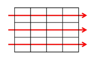
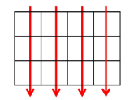
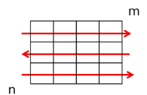
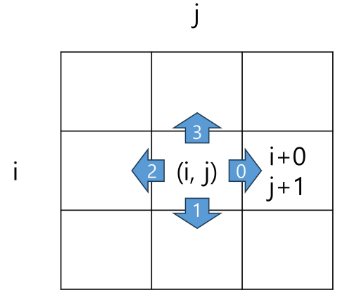
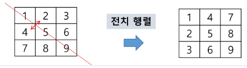

# Array(배열)
* 일정한 자료형의 변수들을 하나의 이름으로 열거하여 사용하는 자료 구조
* python에서는 list, 자료 구조에서는 배열(array)라고 말하지만 혼용하여 사용하기도 한다.
* 배열의 필요성
    * 프로그램 내에서 여러 개의 변수가 필요할 때, 일일이 다른 변수명을 이용하여 자료에 접근하는 것은 매우 비효율적일 수 있다.
    * 배열을 사용하면 하나의 선언을 통해서 둘 이상의 변수를 선언할 수 있다.
    * 단순히 다수의 변수 선언을 의미하는 것이 아니라, 다수의 변수로는 하기 힘든 작업을 배열을 활용해 쉽게 할 수 있다.


## 1차원 배열
* 1차원 배열의 선언
    * 별도의 선언방법이 없으면 변수에 처음 값을 할당할 때 생성
    * index 하나로 접근 가능
    * 이름 : 프로그램에서 사용할 배열의 이름
        * `Arr = list()`, `Arr = []`, `Arr = [1, 2, 3]`, `Arr = [0] * 10` 등
    * 1차원 배열의 접근
        * `Arr[0] = 10` : Arr의 0번째 index에 10을 저장 


## 2차원 배열
* 2차원 배열의 선언
    * 1차원 list를 묶어놓은 list
    * 2차원 이상의 다차원 list는 차원에 따라 index를 선언
    * 2차원 list의 선언 : 행의 개수, 열의 개수를 필요
    * python에서는 data 초기화를 통해 변수 선언과 초기화가 가능
    ```python
    # 2행 4열의 2차원 list
    arr = [[0, 1, 2, 3],
           [4, 5, 6, 7]] 
    ```
* 배열 순회
    * (n * m)배열의 (n*m)개의 모든 원소를 빠짐없이 조사하는 방법
    * 행 우선 순회

        

        ```python
        # i 행의 좌표
        # j 열의 좌표
        for i in range(n) :
            for j in range(m) :
                f(array[i][j]) # 필요한 연산 수행
        ```
    * 열 우선 순회
        
        
        
        ```python
        # i 행의 좌표
        # j 열의 좌표
        for j in range(m) :
            for i in range(n) :
                f(array[i][j]) # 필요한 연산 수행
        ```
    * 지그재그 순회
        
        

        ```python
        # i 행의 좌표
        # j 열의 좌표
        for i in range(n) :
            for j in range(m) :
                f(array[i][j + (m-1-2*j)*(i%2)])
        ```
* 델타를 이용한 2차 배열 탐색
    * 2차 배열의 한 좌표에서 4방향의 인접 배열 요소를 탐색하는 방법
    * index (i, j)인 칸의 상하좌우칸 (ni, nj)

        

        ```python
        # 방향별로 더할 값
        di = [0, 1, 0, -1]
        dj = [1, 0, -1, 0]

        for k in [0, 1, 2, 3] :
            i += di[k]
            j += dj[k]
        ```
* 전치 행렬

    

    ```python
    # i 행의 좌표
    # j 열의 좌표
    arr  [[1, 2, 3][4, 5, 6][7, 8, 9]]

    for i in range(3) :
        for j in range(3) :
            if i < j :
                arr[i][j], arr[j][i] = arr[j][i], arr[i][j]
    ```