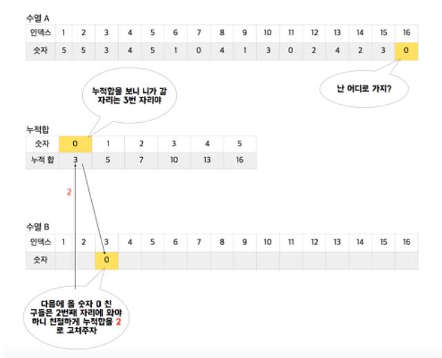
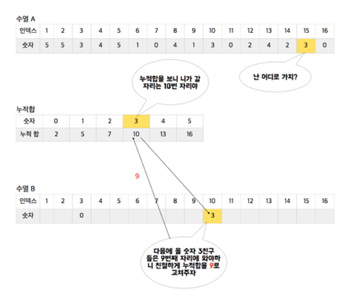
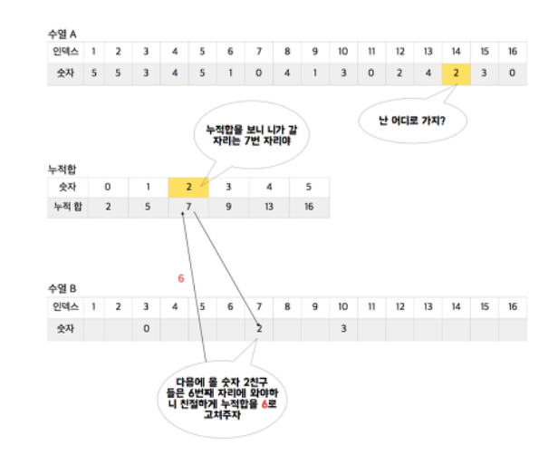

# sort 정렬
* 2개 이상의 자료를 특정 기준에 의해 오름차순 또는 내림차순으로 재배열하는 것
* 대표적인 정렬 방식
    * 버블 정렬 Bubble Sort
    * 카운팅 정렬 Counting Sort
    * 선택 정렬 Selection Sort
    * 퀵 정렬 Quick Sort
    * 삽입 정렬 Insertino Sort
    * 병합 정렬 Merge Sort
* 시간 복잡도 비교

    

    * 카운팅 정렬 오타 : 'k가 비교적 작을때만 가능'이다. (비고란)

## 버블 정렬 Bubble Sort
* 인접한 두 개의 원소를 비교하며 자리를 계속 교환하는 방식


* 정렬 과정
    1. 첫 번째 원소부터 인접한 원소끼리 계속 자리를 교환하면서 맨 마지막 자리까지 이동한다.
    2. 한 단계가 끝나면 가장 큰 원소가 마지막 자리로 정렬된다.
* 교환하며 자리를 이동하는 모습이 물위에 올라온 거품 모양과 같다고 하여 버블 정렬이라고 부른다.
* 중요한 것은 정렬을 완료한 곳은 또다시 돌지 않는 것!
* 시간 복잡도 `O(n**2)`
* 배열을 활용한 버블 정렬
    ```python
    # while문을 이용햔 bubble sort
    lst = [8, 5, 3, 1, 4, 7, 9]
    num = len(lst)

    while num > 0 :
        for i in range(num-1) :
            if lst[i] > lst[i+1] :
                lst[i], lst[i+1] = lst[i+1], lst[i]
        num -= 1

    print(lst) # [1, 3, 4, 5, 7, 8, 9]

    # 이중 for문을 이용한 bubble sort
    lst = [8, 5, 3, 1, 4, 7, 9]

    for i in range(len(lst)-1) :
        for j in range(0, i) :
            if lst[j] > lst[j+1] :
                lst[j], lst[j+1] = lst[j+1], lst[j]

    print(lst) # [1, 3, 4, 5, 7, 8, 9]
    ```

## 카운팅 정렬 Counting Sort
* 항목들의 순서를 결정하기 위해 집합에 각 항목이 몇 개씩 있는지 세는 작업을 하여 선행 시간에 정렬하는 효율적인 알고리즘
* 제한 사항
    * 정수나 정수로 표현할 수 있는 자료에 대해서만 적용 가능. 각 항목의 발생 횟수를 기록하기 위해, 정수 항목으로 인덱스 되는 카운트들의 배열을 사용하기 때문
    * 카운트들을 위한 충분한 공간을 할당하려면 집합 내의 가장 큰 정수를 알아야 한다.
* 시간 복잡도
    * `O(n+k)` : n은 list의 길이, k는 정수의 최대값


    ```python
    N = 6 # input 길이
    K = 9 # input의 최댓값
    data = [7, 2 ,4, 5, 1, 3]
    counts = [0] * (K+1)
    temp = [0] * K

    for x in data : # 정렬1번
        counts[x] += 1

    for i in range(1, K+1) : # 정렬2번
        counts[i] = counts[i-1] + counts[i]

    for i in range(N-1, -1, -1) : # 정렬3번
        counts[data[i]] -= 1
        temp[counts[data[i]]] = data[i]

    print(*temp)
    ```

* 위에서 이해가 안됐다면 아래 그림을 통해 이해해 보자








