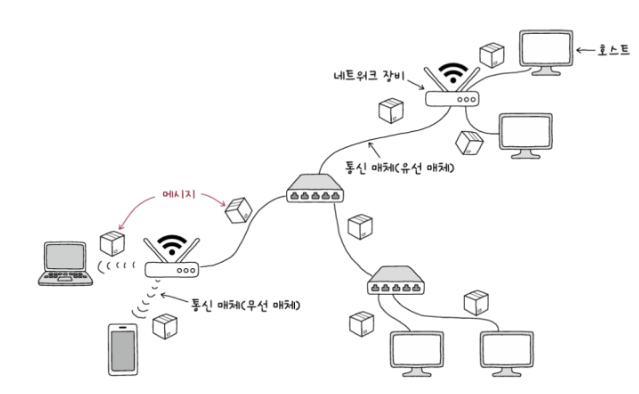
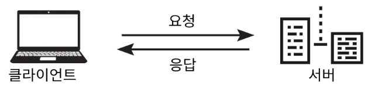
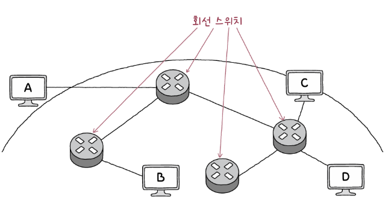
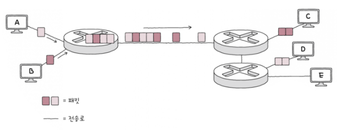

# 컴퓨터 네트워크

## 거시적 네트워크

### 네트워크의 기본 구조
* 노트(node) : 정보를 주고 받을 수 있는 장치.
* 간선(edge) : 정보를 주고 받을 수 있는 유무선의 통신 매체
* 메시지(nessage) : 노드 간 주고 받는 정보

### 네트워크의 구조

1. 호스트(host)
    * 네트워크의 가장자리에 위치한 노드로, 네트워크를 통해 흐르는 정보를 최초로 생성 및 송신하고, 최종적으로 수신한다. 종단 시스템(end system)이라고도 한다. 호스트는 네트워크 상에서 특정한 역할을 수행하기도 하는데 대표적으로 서버와 클라이언트가 있다.
        * 서버(server) : "어떤 서비스"를 제공하는 호스트
            * 이때 "어떤 서비스"는 파일(파일 서버), 웹 페이지(웹 서버), 메일(메일 서버) 등이 될 수 있다.
        * 클라이언트(client) : 서버에게 어떠한 서비스를 요청하고 서버의 응답을 제공받는 호스트
        * 서버와 클라이언트의 관계
            * 클라이언트는 서버에 요청(request)를 보내고, 그에 대한 응답(response)를 제공 받는다.

        

2. 네트워크 장비
    * 네트워크 가장자리에 위치하지 않은 노드, 즉 호스트 간 주고받을 정보가 중간에 거치는 노드로, 중간 노드라고도 한다. 이더넷 허브, 스위치, 라우터, 공유기 등이 있다.
3. 통신 매체
    * 각 노드를 연결하는 간선으로, 유선으로 연결하는 유선 매체, 무선으로 연결하는 무선 매체가 있다.
4. 메시지(message)
    * 통신 매체로 연결된 노드가 주고 받는 정보

### 범위에 따른 네트워크 분류
1. <a style="color:yellow">LAN(Local Area Network)</a> : 근거리 통신망
    * 가정, 기업, 학교처럼 한정된 공간에서의 네트워크
2. CAN(Campus Area Network)
    * 학교 또는 회사의 여러 건물 단위로 연결되는 규모의 네트워크
3. MAN(Matropolitan Area Network)
    * 도시나 대도시 단위로 연결되는 규모의 네트워크
4. <a style="color:yellow">WAN(Wide Area Network)</a> : 광역 통신망
    * 다른 LAN에 속한 호스트와 메세지를 주고받아야 할 때 필요하며, 대표적으로 인터넷이 있다.
* ISP(Internet Service Provider) : 인터넷 서비스 업체
    * 사용자에게 인터넷과 같은 WAN에 연결 가능한 회선을 임대하는 등의 서비스를 제공
    * KT, SKT, LG유플러스, SK브로드밴드 등이 있음

### 메시지 교환 방식에 따른 네트워크 분류
* <a style="color:yellow">회선 교환 방식(circuit switching)</a> -> 회선 교환 네트워크

    

    * 메시지 전송로인 회선(circuit)을 설정하고, 회선을 통해 메시지를 주고 받는 방식.
    * 회선을 설정한다 = 두 호스트가 연결되었다 = 전송로를 확보하였다
    * 회선 스위치 : 회선 교환 네트워크가 올바르게 동작하기 위해 호스트 간의 회선을 적절하게 설정하는 네트워크 장비
    * 장점 : 호스트 사이 연결을 확보한 뒤에 메시지를 주고받으므로 주어진 시간 동안 전송되는 정보의 양(전송률)이 비교적 일정
    * 단점 : 회선 이용 효율이 낮아질 수 있음 -> 메시지를 주고받지 않으면서 회선을 점유하는 것은 낭비
        * 위 그림에서 A가 B에게 정보를 전달하기 위해 3개의 회선을 점유하여 연결된 채로 정보를 주고 받지 않는다면(어떠한 메세지도 A-B 회선에 메시지가 흐르지 않는다면) C, D가 A, B에게 정보를 보내고 싶어도 보낼 수 없는 상황 발생
* <a style="color:yellow">패킷 교환 방식(packet switching)</a> -> 패킷 교환 네트워크

    

    * 메시지를 패킷으로 쪼개어 전송. 이 패킷들은 수신지에서 재조립됨.
        * 패킷(packet) : 패킷 교환 네트워크상에서 송수신되는 메시지의 단위
    * 회선 교환 방식의 문제점을 해결한 방식
    * 현재 인터넷은 대부분 패킷 교환 방식을 사용
    * 패킷 스위치 : 패킷의 송수진지 식별, 패킷이 이동할 최적의 경로 설정
        * 라우터(router), 스위치(switch) 등이 있음
    * 페이로드(payload) : 패킷을 통해 전송하고자 하는 데이터
    * 헤더(header), 트레일러(trailer) : 부가 정보, 제어 정보
        * 택배(페이로드)를 보낼 때 송장(헤더, 트레일러)을 보내느 것과 동일하게 생각하면 된다.

### 주소(address)
* 패킷의 헤더에 담기는 대표적인 정보
* 송수신지를 특정하는 정보
* IP 주소, MAC 주소 등이 있다.

### 송수신지 유형에 따른 전송 방식
* <a style="color:yellow">유니캐스트(unicast)</a>
    * 가장 일반적인 형태의 송수신 방식
    * 하나의 수신지에 메시지를 전송하는 방식
    * 송신지와 수신지가 일대일로 메시지를 주고 받는 경우이다.
* <a style="color:yellow">브로드캐스트(broadcast)</a >
    * 자신을 제외한 네트워크상의 모든 호스트에게 전송하는 방식
        * 브로드캐스트의 수신지는 브로드캐스트 도메인이며 이는 자신을 제외한 네트워크사으이 모든 호스트이다.
    * 브로드캐스트 도메인(broadcast domain) : 브로드캐스트가 전송되는 범위
* 멀티캐스트(multicast)
    * 네트워크 내의 동일 그룹에 속한 호스트에게만 전송하는 방식
* 애니캐스트(anycast)
    * 네트워크 내의 동일 그룹에 속한 호스트 중 가장 가까운 호스트에게 전송하는 방식